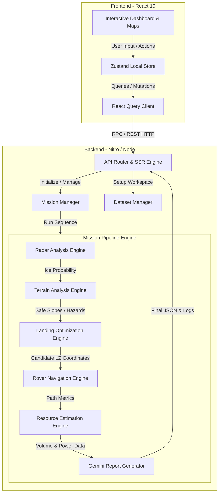

# Technical Documentation: Lunar Mission Decision Support System (LMDSS)

The **Lunar Mission Decision Support System (LMDSS)** is a full-stack, high-performance planetary analysis and planning platform designed to assist lunar scientists and mission engineers in evaluating landing sites, planning rover traverses, and estimating resources in the lunar South Pole region (specifically around Shackleton Crater).

---

## 1. System Architecture Overview

LMDSS is built as a unified web application utilizing an SSR (Server-Side Rendering) architecture. It connects interactive frontend visualization layers directly to heavy-duty backend geospatial and analytical pipelines.



---

## 2. Technology Stack

### Frontend
- **Core Framework**: React 19 (compiled and hot-reloaded using Vite).
- **Routing**: TanStack Router (enforces static path type-safety).
- **Data Fetching**: TanStack Query (handles client-server state sync, cache validation, and polling).
- **State Management**: Zustand (lightweight client state for current active session).
- **Styling & UI**: Tailwind CSS & Vanilla CSS (incorporates dark-mode assets, glassmorphism, responsive grids, and grid overlay maps).
- **Charts & Graphs**: Recharts (dynamic rendering of radar accessibility, path elevation profiles, and resource charts).
- **Animations**: Framer Motion (page-entry transitions and step wizard step status).

### Backend
- **Framework & Compilation**: Nitro engine + TanStack Start (packages standalone build servers with native ES modules support).
- **Runtime**: Node.js or Bun.
- **Geospatial Processing & Image Manipulation**: Jimp (native JS buffer raster processing).
- **AI Analytics**: `@google/genai` (integration with Gemini 2.5 Flash for mission risk assessments).

---

## 3. Directory Layout

```
├── .github/                  # Github workflows and CI settings
├── .output/                  # Standalone built production server (Generated post-build)
├── backend/                  # Upload and workspace folder (Created at runtime)
│   └── uploads/              # Contains folder structures per mission-id
│       └── mission-LM-XXX/   
│           ├── input/        # Uploaded raw datasets (.tif)
│           ├── processed/    # Processed analytical matrices/overlays (.png)
│           ├── outputs/      # Compiled routing/elevation JSONs
│           └── metadata/     # Logs, AI summaries, and configurations
├── data/                     # Local demo dataset placeholders (Ignored from git)
├── public/                   # Shared static files and visual demo resources
│   └── demo-data/            # High-resolution backup rasters for Demo mode
├── src/
│   ├── assets/               # Image assets and raw styles
│   ├── components/
│   │   ├── app/              # Reusable page wrappers (Sidebar, Topbar, Panel, etc.)
│   │   └── ui/               # Lower-level form controls
│   ├── lib/                  # Shareable utils (types, error handlers, mock datasets)
│   ├── routes/               # Directory-based TanStack routing pages
│   │   ├── __root.tsx        # Top shell, HTML wrappers, and fallback error boundary
│   │   ├── _app.tsx          # Authenticated App shell (Loads Sidebar)
│   │   ├── _app.dashboard.tsx# Main control metrics and summary timeline
│   │   └── _app.*.tsx        # Pipeline route sub-pages
│   ├── store/                # Zustand global client-side state stores
│   ├── server/               # Pure backend code
│   │   ├── api/              # RPC endpoints definition
│   │   ├── backend/          # Geospatial processing engines
│   │   ├── dataset-manager.ts# Scans, verifies, and initializes standard local demo files
│   │   └── mission-manager.ts# In-memory storage of current mission context
│   ├── entry-client.tsx      # Hydrates React client application
│   ├── entry-server.tsx      # Generates HTML response string
│   └── server.ts             # Custom HTTP request router and API handler
├── vite.config.ts            # Combines TanStack, React, Tailwind, and Nitro configs
└── render.yaml               # Render Blueprint file for auto-deployments
```

---

## 4. Architectural Component Walkthrough

### 4.1 Server Handler (`src/server.ts`)
Acts as the central network traffic controller.
- Intercepts raw POST requests for binary files (e.g. `/api/upload`) using multi-part form data buffers.
- Manages standard analytical sub-page API routes (`/api/terrain`, `/api/landing`, `/api/navigation`, `/api/report`).
- Delegating all client-server RPCs (generated using `createServerFn`) directly to the TanStack Start runtime server entry point via `getServerEntry()`.
- Captures unhandled SSR exceptions and displays them inside a clean, formatted debug container on the client to avoid invisible server crashes.

### 4.2 State Management & Stores
- **Server State**: Managed using `@tanstack/react-query`. Caches queries like `["activeMission"]` and refetches/polls every 1000ms if the backend status is `"uploading"` or `"processing"`.
- **Client State**:
  - `useMissionStore` (`src/store/mission-store.ts`): Tracks the active mission identifier, metadata name, target region, and operational status.
  - `useDemoMode` (`src/store/demo-store.ts`): Toggles whether the interface loads static pre-rendered demo screens instead of waiting for file uploads.

---

## 5. Decision Support Pipelines (Analytical Engine)

### 5.1 Radar Analysis Engine (`RadarAnalysisEngine.ts`)
- **Inputs**: Raw dual-frequency polarimetric SAR (DFSAR) raster data.
- **Mathematical Modeling**:
  - Computes the **Circular Polarization Ratio (CPR)**:
    $$\text{CPR} = \frac{I_{LR}}{I_{LL}}$$
    High CPR values (> 0.65) in shaded areas suggest subsurface water-ice deposits.
  - Computes the **Degree of Polarization (DOP)** to separate volume scattering (ice) from surface scattering (rough rock).
- **Output**: An ice-probability overlay, identifying zones with confidence ratings (> 90%).

### 5.2 Terrain Analysis Engine (`TerrainAnalysisEngine.ts`)
- **Inputs**: Digital Elevation Models (DEM) from Lunar Orbiter Laser Altimeter (LOLA).
- **Geospatial Processing**:
  - Calculates local **Slopes** in degrees by analyzing gradients between neighboring height cells.
  - Computes **Surface Roughness** factor representing micro-relief variances.
- **Output**: Obstacle and Hazard Maps. Classifies terrain into *Safe* (< 10° slope), *Caution* (10° - 15° slope), and *Hazard* (> 15° slope or high roughness).

### 5.3 Landing Optimization Engine (`LandingOptimizationEngine.ts`)
- **Algorithm**: Simplified Multi-Objective Optimization.
- **Parameters Evaluated**:
  1. Average Slope (Minimize).
  2. Annual Illumination (Maximize - for solar power).
  3. Distance to Ice Deposits (Minimize).
  4. Hazard Density (Minimize).
- **Output**: Generates a sorted array of candidate Landing Zones (LZs) ranked by score (0.0 to 1.0) and highlights the optimal LZ (LZ-01).

### 5.4 Rover Navigation Engine (`RoverNavigationEngine.ts`)
- **Algorithm**: Weighted A* Pathfinding.
- **Routing Heuristic**:
  - Path cost is calculated as a function of Euclidean distance combined with steep slope penalties:
    $$\text{Cost} = \text{Distance} \times (1 + \alpha \cdot \text{Slope}^2)$$
  - Blocks traversal through cells classified as extreme hazards (> 15° slope).
- **Output**: Safe traverse routing coordinates connecting the landing zone to target water ice reservoirs, complete with dynamic elevation and energy slope profiles.

### 5.5 Resource Estimation Engine (`ResourceEstimationEngine.ts`)
- **Formulae**:
  - **Ice Volume**: Calculates reservoir volume based on high CPR surface area ($A_i$) and estimated depth parameters:
    $$\text{Volume} (V) = A_i \times \text{Depth} \times \text{Purity} \times \text{Density}$$
  - **Power Budget**: Compiles solar flux availability based on average monthly illumination hours.

---

## 6. API Endpoints

### File Upload Pipeline
`POST /api/upload`
- Accepts `multipart/form-data` containing the file payload.
- Saves the file to `backend/uploads/mission-${id}/input/dfsar_demo_input.tif`.
- Triggers the validation and dataset alignment sequence.

### Trigger Pipeline Calculation
`POST /api/analyze`
- Triggers the execution of the geospatial analysis sequence.
- Updates the active mission context progress and marks status to `"ready"` upon completion.

### Dynamic Overlays Fetching
- `GET /api/terrain` -> Returns hazard grid statistics and slope vectors.
- `GET /api/landing` -> Returns ranked optimized landing zones.
- `GET /api/navigation` -> Returns the A* path route array.
- `GET /api/report` -> Returns resource volumes, power budgets, and final summaries.

---

## 7. Render Deployment Guide

LMDSS is fully configured for deployment on Render's web service environments.

### 7.1 Automatic Blueprint Deploy
The repository includes a `render.yaml` configuration. You can deploy it instantly:
1. In your **Render Dashboard**, click **New +** and select **Blueprint**.
2. Select your connected repository.
3. Render will auto-provision a web service named `lunar-forecast` using the correct environment.

### 7.2 Manual Web Service Configuration
If deploying as a standard web service manually, input the following configuration values:

- **Runtime**: `Node`
- **Build Command**: 
  ```bash
  npm install && npm run build
  ```
- **Start Command**: 
  ```bash
  npm run start
  ```
- **Environment Variables**:
  - `NODE_ENV` = `production`
  - `VITE_DEMO_MODE` = `true` (Enables pre-loaded Shackleton Crater mock datasets)
  - `GEMINI_API_KEY` = `[YOUR_API_KEY]` (Optional: for natural language report summaries)
